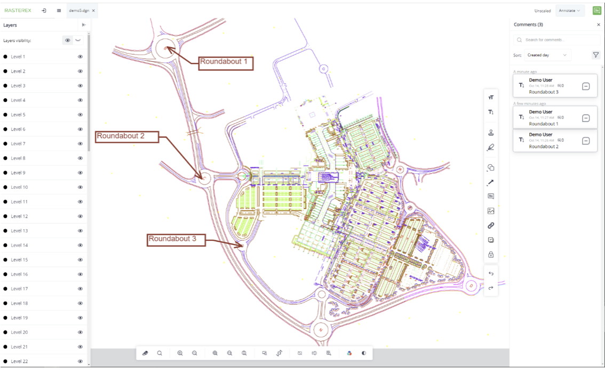

Rasterex Web SDK is a JavaScript based library that is created to enable viewing and annotating using a large variety of file formats. This is accomplished using a server back-end that provides processed data based on the original file format.  The file content is rendered using HTML 5 canvas and is compatible with most modern browsers.  

There are to versions of the Rasterex Web SDK
- `Pro version` - Uses Foxit web sdk as the technology to display and handle PDF.
- `Basic version` – Uses PDFJS as the the technology to display and handle PDF.

Many methods are provided to perform operations on the drawing/document. These operations include.
- Compare/Overlay
- Data extraction and manipulation
- Selected visualization based on underlying structures.
- Measurement take/off operations.
- Document page manipulation (Pro version only)
- Text search and extract.
- Extraction of other relevant data from CAD drawings.

---

### Rasterex Web SDK viewer
The viewer is built using the Angular framework and is intended as a complete viewer that can demonstrate most of the Rasterex Web SDK current capabilities. The source for the viewer is freely available on our Github page. End users can modify and customize this viewer to suit their needs.

There are two versions of the Rasterex Web SDK

**Pro version** - Uses Foxit web SDK as the technology to display and handle PDF.

**Basic version** – Uses PDFJS as the technology to display and handle PDF.

---

### Github links

**Pro Version**  
[https://github.com/Rasterex-Software/Rasterex-Web-Viewer](https://github.com/Rasterex-Software/Rasterex-Web-Viewer)

**Basic Version**  
[https://github.com/Rasterex-Software/Rasterex-Web-Viewer-main-pdfjs](https://github.com/Rasterex-Software/Rasterex-Web-Viewer-main-pdfjs)

