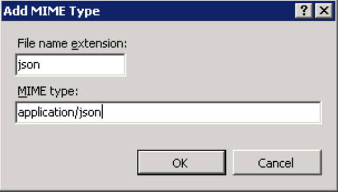
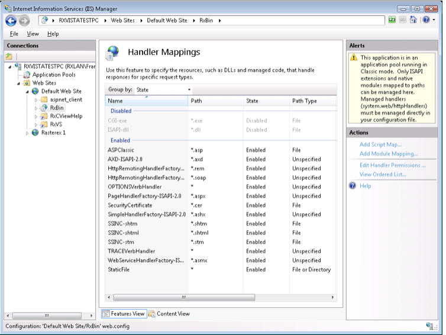
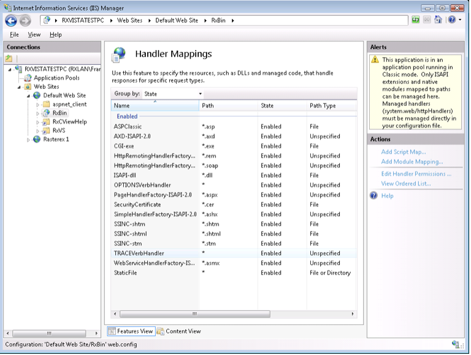
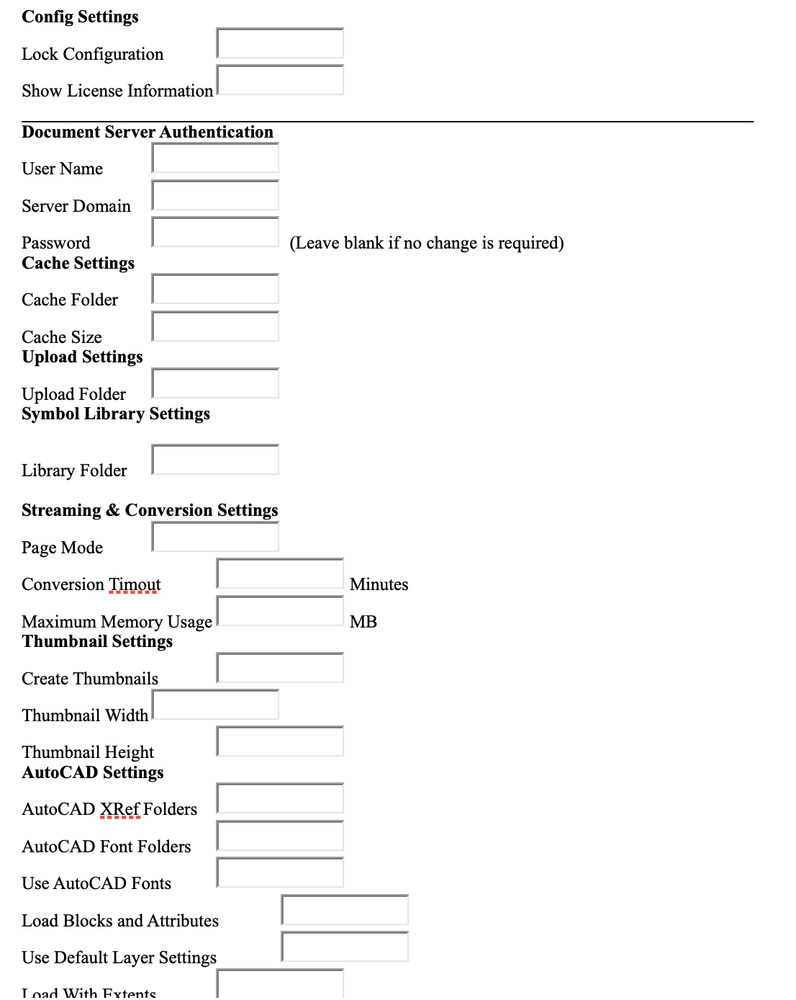
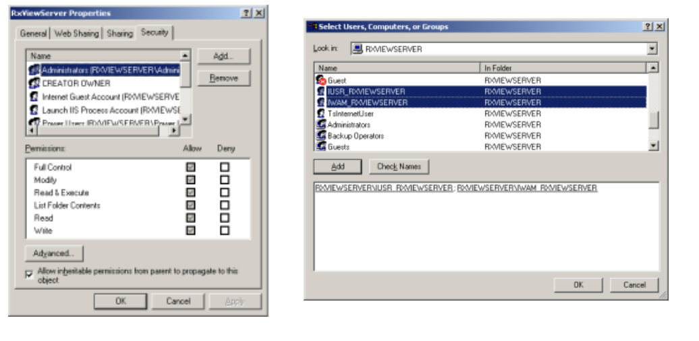

## Introduction
This document contains information on how to set up and configure RxView360 Web™.

`RxView360` is a server-based solution for fast sharing of documents and drawings over the web – with no software installed on the client machines!

`RxView360` allows users to view, print, markup and collaborate on more than 250 different file formats (CAD drawings, plot-files, PDF files, Office documents, raster images etc.) directly within their browser – via intranet, extranet, Internet, web portals or content management systems.

Contact Rasterex via the Rasterex website http://www.rasterex.com/ 

Email to sales@rasterex.com

**RxWebView**, **RimEngine**, **RxFilter**, and **RxView360** are registered trademarks belonging to Rasterex Software a.s

---

## Disclaimer
Rasterex Software a.s makes no representations or warranties regarding the contents of this document, and specifically disclaims any implied warranties of merchantability of fitness for any particular purpose. Furthermore, Rasterex Software a.s reserves the right to revise this document and to make changes from time to time in the contents without an obligation by Rasterex Software a.s to notify any person of such revision changes.

---

## License setup
In order to use RxView360 you will need to have the license setup before installation.

If you have received a network type license you will need to set up a FlexLM license server.

We recommend that you have this set up and working before you install RxView360.

You can download the FlexLM license server from the Rasterex Web.

http://download.rasterex.com/FLexNETService.exe

You will find description on how to set this up here.

http://download.rasterex.com/How_to_install_FlexNET_service.pdf

If you have received a single license you only need to place the license in a folder on the server.

During installation you specify either the IP address or machine network name of the machine where FlexLM service is running, or in the case of a single license the full path to the license file.

### Platforms supported
- RxView360 is designed for IIS (Internet Information Server™) 7.0 and newer.
- Windows Server 2012™, Windows Server 2016™ and Windows Server 2019™


### Hardware Requirements
- Minimum 2 GHz multi core processor with 4 GB or RAM. 
- 3.GHz or higher with 16 GB RAM recommended.

---


## Additional documentation and samples
In addition to this document there is separate end user documentation and various sample files included in the installation.

You may modify and use the included html source in your own product or implementation. 

### Documentation overview 
| Document                        | Format        | Description                                                           |
|---------------------------------|---------------|-----------------------------------------------------------------------|
| End_user_guide_RxView360.pdf     | Acrobat PDF   | Thin client reference. Located in the RxView360 Server installation folder |
| RxView360_API_Specification.pdf | Acrobat PDF   | API description for integrators.                                      |

---

## Cache control for markup files
In order to make sure markup files are not cached by the browser you will need to set up the IIS HTTP headers to prevent caching of rxml markup files. See the IIS documentation on how to set up cache control.

---

## Mime settings
Make sure JSON mime type is registered for IIS



---

## IIS Handler mappings
In some cases the Handler mapping for the RxbinWeb  application is not set correctly by the installation, resulting in a http 500 error. You can check this by selecting the RxBinWeb Application and open the “Handler Mappings” list.



<div style={{ display: 'flex', alignItems: 'center', marginBottom: "20px" }}>
  
  <div>
  <p>
    To correct the problem, select the “Edit Handler Permissions” Action. In the dialog check the Execute flag.
  </p>
  <p>
  This will allow the RxCSISAPI.DLL to run.
</p>
  </div>
</div>





---

## rxconfig.js
contains an object that hold the main URLs that connect the RxWebClient web page with the server. The installation should set up the correct URLs in this file but if you need to move the server or change the configuration, make sure that the URLs in this file is updated to reflect these changes.

The variables are.

- `xmlurl` – Hold the URL to the main interface of the server ISAPI.
- `xmlurldirect` – Hold the URL to the RxCSISAPI.dll.
- `xmlurlmarkup` – Address where list of markup files are retrieved using GET. Default the same as xmlurl.
- `opensessionurl` - RxCSISAPI.dll open session interface URL
- `openMsessionurl` - RxCSISAPI.dll open markup session interface URL
- `closesessionurl` - RxCSISAPI.dll close session interface URL.
- `CanvasSaveUrl` - RxCSISAPI.dll interface that receive and save canvas as image data.
- `xmlurlmarkupsave` – Hold the URL to the interface of the ISAPI that is used to save markup.
- `FileuploadURL` – Hold the URL to the ISAPI that is used for uploading files.
- `PDFExportURL` – The URL that is used for PDF Export.
- `UploadServerfolder` – The folder on the server where uploaded files are stored.
- `uploadfolderURL` – The URL that the server uses to retrieve uploaded files. 
- `xmlurlrel` - URL to the folder where the ISAPI reside.
- `htmlviewerurl` – The URL of the RxWebClient html page.
- `splashscreen` - The URL of the RxWebClient startup graphics.

Also included in this file is a reference to a configuration source and a Boolean variable that determine if a configuration file should be used or not.

The configurationLocation variable should be set to a server source that give an XML structure in return that contain certain settings that can be used to control the behavior of RxView360 client.

```javascript
var configurationLocation = “http://viewserver.rasterex.com/RxBinweb/RxCSISAPI.dll?WebClientGetConfig";
var bGetconfig = false;
```

The XML Configuration structure must conform to the following tags.

```xml
<?xml version="1.0" encoding="UTF-8"?>
<Configuration>
    <Context>testconfig</Context>
    <CurrentUserName>Demo</CurrentUserName >
    <MarkupLayer>1</MarkupLayer>
    <MarkupColor>red</MarkupColor>
    <XmlUrl>http://viewserver.rasterex.com/RxBinweb/RxCSISAPI.dll?WebClient</XmlUrl>
    <XmlUrlRel>http://viewserver.rasterex.com/RxBinweb</XmlUrlRel>
    <MarkupSaveUrl>http://viewserver.rasterex.com/RxBinweb/RxCSISAPI.dll?WebClientSaveMarkup</MarkupSaveUrl>
    <EnableMarkupEdit>True</EnableMarkupEdit>
    <CanConsolidate>False</CanConsolidate>
    <CanChangeSignature>False</CanChangeSignature>
    <CanChangeLayer>True</CanChangeLayer>
    <Readonlymarkup>False</Readonlymarkup>
    <EnableFileOpen>False</EnableFileOpen>
    <ReverseScale>True</ReverseScale>
    <UseCustom>True</UseCustom>
   <InitialDocument>http://download.rasterex.com/F_16.tif</InitialDocument>
    <RefreshMarkup>False</RefreshMarkup>
    <stamps>
		<stamp>Approved</stamp>
		<stamp>Draft</stamp>
		<stamp>Received</stamp>
		<stamp>Rejected</stamp>
		<stamp>Reviewed</stamp>
		<stamp>Revised</stamp>
    </stamps>
    <layers>
	<layer>
		<name>Layer 0</name>		
		<color>#ffffff</color>		
		<number>0</number>		
<state>on</state>
	
	</layer>
	<layer>
		<name>Layer 1</name>		
		<color>#ff0000</color>		
		<number>1</number>		
<state>off</state>
	</layer>
	<!--additional layers -->
    </layers>
</Configuration>
```

**It is important to note that if you change the xmlurl value of the rxconfig.js file you will also need to change the content of the defaultconfig.xml file in the bin folder as this will override this setting.**

This configuration can be used to load an initial drawing with the loading of the RxWebClient web page and set additional parameters Including.

- `Context` – Reserved for future use.
- `CurrentUserName` – The Signature for all markups created in this session.
- `DisplayName` – The Display name associated with the Signature for all markups created in this session. This is displayed instead of the Signature.
- `MarkupLayer` – Markup layer used for this session.
- `MarkupColor` – Markup color used for this session.
- `XmlUrl` – URL to the main interface of the server ISAPI.
- `XmlUrlRel` – URL to the folder where the ISAPI reside.
- `MarkupSaveUrl` – URL to the interface of the ISAPI that is used to save markup.
- `EnableMarkupEdit` – Boolean value to determine if the user can edit markup.
- `CanConsolidate` – Boolean value to determine if the user can perform consolidation.
- `CanChangeSignature` – Boolean value that determine if the user can change signature.
- `CanChangeLayer` – Boolean value that determine if the user can change markup layer. If this is false the text and line color for all markup objects will be locked the markup layer color.
- `Readonlymarkup` – Boolean value that determine if markup is read only.
- `ReverseScale` – Boolean value that determine if selected measure scale should be reversed.
- `Paperwidth` and Paperheight – Determine the paper size that the image created for print is optimized for. 
- `EnableFileOpen` – Boolean value that determine if the File Open function is available.
- `UseCustom` – Boolean value that determine if the openFileCustom is to be used during startup.
- `InitialDocument` – URL to a file that is opened when the RxWebClient web page is loaded.
- `RefreshMarkup` – Boolean value that determine if markup is refreshed when saved to update the markup from the server.
- `Custom` Stamps – You can define custom stamps by adding a stamps section with sub stamp definitions. This will override the default stamp values.

Example
```xml
<stamps>
    <stamp>Approved</stamp>
    <stamp>Model</stamp>
    <stamp>Received</stamp>
    <stamp>Rejected</stamp>
    <stamp>Reviewed</stamp>
    <stamp>Revised</stamp>
</stamps>
```

`Layers` – You can define the markup layers and visibility state by adding a Layers section with sub layer definitions. This will override the default layer values. You can use this to control which layers are visible for each user.

---

## Rxcorefunctions.min.js
This is the JavaScript file containing the core methods for operating the html5 Canvas viewer.

---

## index.html
Included in the installation is an html page that hold the interface for the RxWebClient.

---

## Verify the server setup
An html file called **RxVStest360.htm** is included an available in the web root folder.Use this file to test the configuration and to trap common problems with setting up RxView360.
 
You can access the server configuration page by using the **Check Configuration** link.Use this page to set up how the server module interacts with files and folders.
Check that the license server is set up correctly by using the **check out license test**.
Check that RxCSISAPI is able to convert to content format using the **File Stream test**.

---

## RxView360 Web configuration page
Open the configuration page for the RxView360 server module.

http://www.yourserver.com/rxbinweb/RxCSISAPI.dll?Config

The following page will be displayed:

Rasterex RxViewServer - 64-bit

Version: 20.0.0.234

(c)2004-2021 Rasterex Software a.s

Configuration 

Using Config File: C:\Program Files (x86)\Rasterex\RxViewServer\bin\rxcsisapi.ini



**Config Settings**

Lock Configuration – Set this to Yes to prevent access to this page from outside. You will have to manually change the rxcsisapi.ini file in order to turn the visibility back on.
Show License Information - If set to No, license settings are hidden.

**License Settings** – If you are using a Static license this should be set to Static otherwise leave the setting as "Concurrent" which is the default value.

**Document Server Authentication** – This setting is normally hidden. You will need to manually change the rxcsisapi.ini file and change ServerLoginHidden=1 to ServerLoginHidden=0 if you want to see this in the configuration web page.

If RxView360 need to access drawings and documents that the IIS system account does not have access to, you can specify a different user account that has the necessary rights to retrieve these documents and drawings here.


**Cache Settings** – Specify where the cache files are to be stored and how much disk space the cache files will be allowed to occupy on your hard drive.

Post upload function will upload files using a post interface to RxCSISAPI. This is required for control of cache entries.

**Upload Settings**

Select an Upload folder on the server. This will ensure that you can use POST to transfer files from the client to the server.

Make sure you assign the full control permissions for the RXCSISAPI.DLL process account this is normally the local system account. 

**Symbol Library Settings**
Library Folder – A folder that contain one or more rxsl files with symbol data.

**Streaming and Conversion Settings**
Page Mode – Can be Yes or No. Normally this should be set to Yes.

Conversion Timeout – Set in minutes. The conversion will be terminated if not complete within the set time.

Maximum Memory Usage – Limits the amount any conversion is allowed to allocate on the server.

**Thumbnail Settings**
Create Thumbnails – Set to Yes to allow thumbnails to be created.

Thumbnail Width – Set width of created thumbnails in pixels.

Thumbnail Height – Set height of created thumbnails in pixels.


**AutoCAD Settings**

AutoCAD XRef Folders - Use this settings to control where the AutoCAD reader can locate x-ref files. Folder is relative to the server. Separate paths with semi colon.

AutoCAD Font Folders - Use this settings to control where the AutoCAD reader can locate AutoCAD font files. Folder is relative to the server. Separate paths with semi colon.

Load Blocks and Attributes – Set to “Yes” if you wish to search for and list block attributes.

Use Default Layer Settings  – Set to “Yes” if you wish to Use ensure correct display of content according to layer state. This option will however disable the ability to turn layers on/off.

Load With Extents – If set to Yes the AutoCAD file will be displayed zoomed to Extent when opened.

**Microstation Settings** - Use these settings to control where the Microstation reader can locate x-ref files and font resource files. Normally the upload folder should be set up as the x-ref folder.

---

## Manual configuration
RxView360 installation should normally set up all security settings for you. Should you however, for some reason, need to set this up manually please follow the instructions below.

---

### Windows folder security
You will need to make sure that the following security settings are set for the folders created by the installation.Use explorer to locate each of the folders below. Right click on the folder and select “Properties”.
Select the Security Tab and add the Local System and IUSR built in users to the list of users.
Click the Add button if these are not listed in the user list. Remember to use the local built in user not domain users.



Recommended Folder security settings for RxView360 

| Folder                        | Built-in Account                               | Permissions Required                     |
|-------------------------------|------------------------------------------------|-------------------------------------------|
| RxView360Server               | Internet guest account IUSR, Launch IIS process account, Local System | Read and Execute, Full control           |
| RxView360Server\bin           | Internet guest account IUSR, Launch IIS process account, Local System | Write, Read and Execute, Full control    |
| RxView360Server\bin\cache     | Internet guest account IUSR, Launch IIS process account, Local System | Full control                             |
| RxView360Server\Upload        | Internet guest account IUSR, Launch IIS process account, Local System | Full control                             |


### Internet Information Server folder setup
When you have completed the setup for the windows folders you will also have to review and maybe change the settings for the installed IIS Virtual folders and applications.  

IIS virtual folders and applications.

| Folder name      | Permissions | Execute permissions         |
|------------------|-------------|-----------------------------|
| RxWeb            | Read        | Scripts Only               |
| RxBinWeb         | Read        | Scripts and Executables    |
| Upload           | Read        | None                       |
| RxBinWeb/cache   | Read        | None                       |


---

## RxCSISAPI commands

These functions are intended mainly for debugging purposes and may be changed in future versions of the software.
Show version information
http://www.yourserver.com/bin/RxCSISAPI.dll

### ShowConfig command
This command will display the current configuration. <br/>
http://www.yourserver.com/bin/RxCSISAPI.dll?ShowConfig

### List format readers command.
http://www.yourserver.com/bin/RxCSISAPI.dll?FilterList

### License information command
http://www.yourserver.com/bin/RxCSISAPI.dll?Showlicenseinfo <br/>
Lists the licenses currently in use.

### cacheid
When using an URL to retrieve files using the RxCore.openFile command you can add a cacheid parameter with a unique value. This cacheid allow use of cached content which normally is not supported when opening a file from an URL.
Ex: cacheid=xxxx. The cacheid is added to the URL sent using RxCore.openFile separated with an ampersand & or *&amp*;


